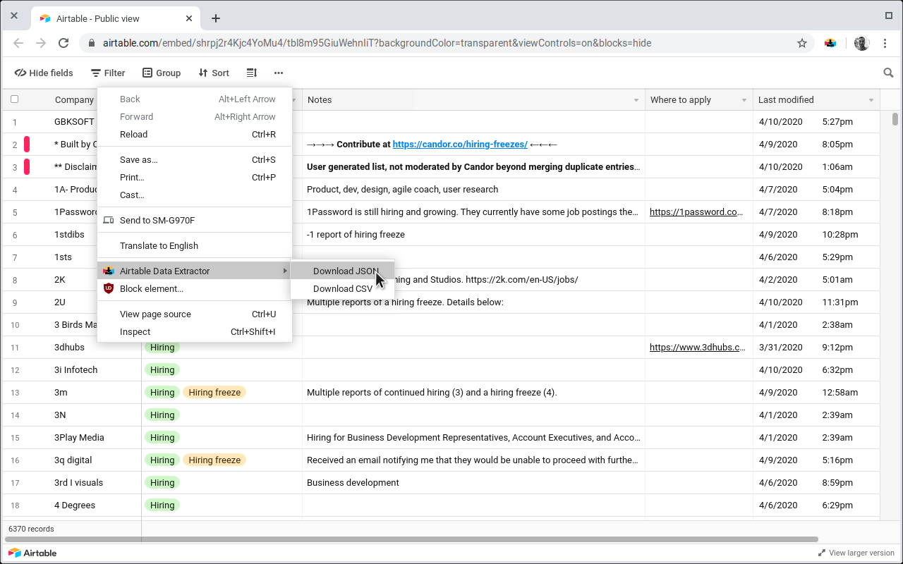

# Airtable Data Extractor

[link-cws]: https://chrome.google.com/webstore/detail/airtable-data-extractor/hecfmeibolfopfblloblipiebnofllac "Version published on Chrome Web Store"

This extension allows you to extract raw data (JSON or CSV) from an Airtable shared view.

Here's a screenshot of it:

# Install

- [**Chrome** extension][link-cws] [][link-cws]

# Thanks

- https://github.com/samuelsimoes/chrome-extension-webpack-boilerplate
